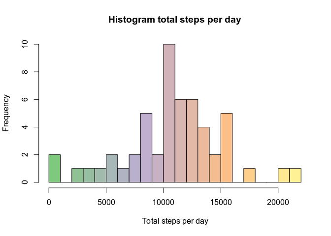
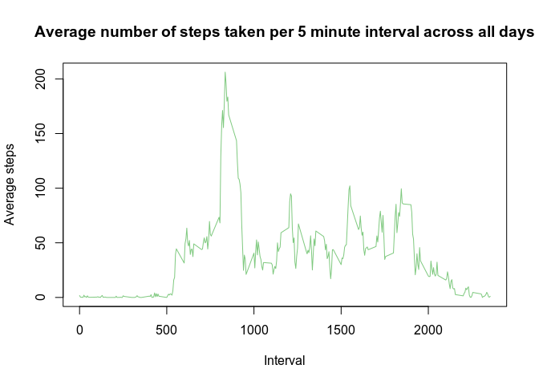
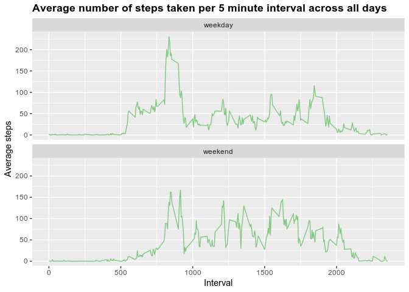

## Loading and preprocessing the data
### Unzip and read data to data frame

```r
unzip("activity.zip")
pa1 <- read.csv("activity.csv", stringsAsFactors = FALSE)
```
### Convert date string to date format

```r
pa1$date <- as.Date(pa1$date)
```
### Show structure of data

```r
str(pa1)
```

```
## 'data.frame':	17568 obs. of  3 variables:
##  $ steps   : int  NA NA NA NA NA NA NA NA NA NA ...
##  $ date    : Date, format: "2012-10-01" "2012-10-01" ...
##  $ interval: int  0 5 10 15 20 25 30 35 40 45 ...
```
### See sample

```r
head(pa1)
```

```
##   steps       date interval
## 1    NA 2012-10-01        0
## 2    NA 2012-10-01        5
## 3    NA 2012-10-01       10
## 4    NA 2012-10-01       15
## 5    NA 2012-10-01       20
## 6    NA 2012-10-01       25
```
## What is mean total number of steps taken per day?
### Calculate the total number of steps taken per day

```r
if(!require("dplyr")) install.packages("dplyr")
library(dplyr)
pa1_perday <- pa1 %>% group_by(date) %>% summarise(total_steps = sum(steps, na.rm = TRUE))
```
### Make a histogram of the total number of steps taken each day

```r
hist(pa1_perday$total_steps, xlab="Total steps per day", main="Histogram total steps per day")
```

<!-- -->

### Calculate and report the mean and median of the total number of steps taken per day

```r
summary(pa1_perday)
```

```
##       date             total_steps   
##  Min.   :2012-10-01   Min.   :    0  
##  1st Qu.:2012-10-16   1st Qu.: 6778  
##  Median :2012-10-31   Median :10395  
##  Mean   :2012-10-31   Mean   : 9354  
##  3rd Qu.:2012-11-15   3rd Qu.:12811  
##  Max.   :2012-11-30   Max.   :21194
```
**Total number of steps: mean = 9354, median = 10395**

## What is the average daily activity pattern?
### Make a time series plot (i.e. type="l") of the 5-minute interval (x-axis) and the average number of steps taken, averaged across all days (y-axis)

```r
pa1_interval <- aggregate(steps ~ interval, pa1, mean)
plot(pa1_interval$interval, pa1_interval$steps, type="l", xlab="Interval", ylab="Average steps", main="Average number of steps taken per 5 minute interval across all days")
```

<!-- -->

### Which 5-minute interval, on average across all the days in the dataset, contains the maximum number of steps?

```r
max_steps <- which.max(pa1_interval$steps)
pa1_interval[max_steps,]
```

```
##     interval    steps
## 104      835 206.1698
```

## Imputing missing values
### Calculate and report the total number of missing values in the dataset (i.e. the total number of rows with NAs)

```r
summary(pa1)
```

```
##      steps             date               interval     
##  Min.   :  0.00   Min.   :2012-10-01   Min.   :   0.0  
##  1st Qu.:  0.00   1st Qu.:2012-10-16   1st Qu.: 588.8  
##  Median :  0.00   Median :2012-10-31   Median :1177.5  
##  Mean   : 37.38   Mean   :2012-10-31   Mean   :1177.5  
##  3rd Qu.: 12.00   3rd Qu.:2012-11-15   3rd Qu.:1766.2  
##  Max.   :806.00   Max.   :2012-11-30   Max.   :2355.0  
##  NA's   :2304
```
**Missing values in dataset: missing steps 2304, no missing date and interval**

### Devise a strategy for filling in all of the missing values in the dataset. The strategy does not need to be sophisticated. For example, you could use the mean/median for that day, or the mean for that 5-minute interval, etc. We choose mean for that 5-miute interval.
### Create a new dataset that is equal to the original dataset but with the missing data filled in.

```r
pa1_no_na <- merge(x=pa1, y=pa1_interval, by="interval", all.x=TRUE) %>% 
        mutate(steps = ifelse(is.na(steps.x), steps.y, steps.x)) %>% 
        select(c("steps", "date", "interval"))
```
### Make a histogram of the total number of steps taken each day and Calculate and report the mean and median total number of steps taken per day. Do these values differ from the estimates from the first part of the assignment? What is the impact of imputing missing data on the estimates of the total daily number of steps?

```r
pa1_no_na_perday <- pa1_no_na %>% group_by(date) %>% summarise(total_steps = sum(steps))
hist(pa1_no_na_perday$total_steps, xlab="Total steps per day", main="Histogram total steps per day")
```

<!-- -->

### Calculate and report the mean and median of the total number of steps taken per day

```r
summary(pa1_no_na_perday)
```

```
##       date             total_steps   
##  Min.   :2012-10-01   Min.   :   41  
##  1st Qu.:2012-10-16   1st Qu.: 9819  
##  Median :2012-10-31   Median :10766  
##  Mean   :2012-10-31   Mean   :10766  
##  3rd Qu.:2012-11-15   3rd Qu.:12811  
##  Max.   :2012-11-30   Max.   :21194
```
**Total number of steps: mean = 10766, median = 10766**

### Do these values differ from the estimates from the first part of the assignment? What is the impact of imputing missing data on the estimates of the total daily number of steps?
**The mean and median after fill missing value is same**

## Are there differences in activity patterns between weekdays and weekends?
### Create a new factor variable in the dataset with two levels – "weekday" and "weekend" indicating whether a given date is a weekday or weekend day.

```r
if(!require("lubridate")) install.packages("lubridate")
library(lubridate)
pa1_no_na <- pa1_no_na %>% 
        mutate(wday = wday(pa1_no_na$date)) %>%
        mutate(wday_type = as.factor(ifelse(wday == 1 | wday == 7, "weekend", "weekday")))
str(pa1_no_na)
```

```
## 'data.frame':	17568 obs. of  5 variables:
##  $ steps    : num  1.72 0 0 0 0 ...
##  $ date     : Date, format: "2012-10-01" "2012-11-23" ...
##  $ interval : int  0 0 0 0 0 0 0 0 0 0 ...
##  $ wday     : num  2 6 1 3 7 5 7 6 4 1 ...
##  $ wday_type: Factor w/ 2 levels "weekday","weekend": 1 1 2 1 2 1 2 1 1 2 ...
```

### Make a panel plot containing a time series plot (i.e. type="l") of the 5-minute interval (x-axis) and the average number of steps taken, averaged across all weekday days or weekend days (y-axis). See the README file in the GitHub repository to see an example of what this plot should look like using simulated data.

```r
if(!require("ggplot2")) install.packages("ggplot2")
library(ggplot2)
pa1_no_na_interval <- aggregate(steps ~ interval + wday_type, pa1_no_na, mean)
ggplot(data=pa1_no_na_interval, aes(x = interval, y = steps)) +
        geom_line() + facet_wrap(.~wday_type, ncol = 1) +
        labs(title="Average number of steps taken per 5 minute interval across all days", x="Interval", y="Average steps") +
        theme(plot.title = element_text(face = "bold"))
```

<!-- -->
